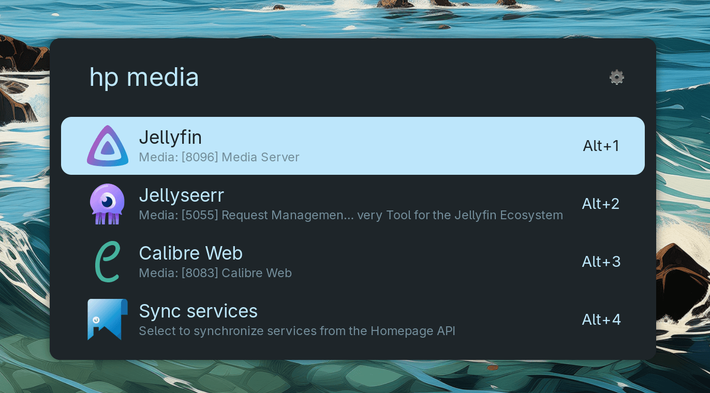

# Homepage Extension for Ulauncher

An unofficial extension for [Ulauncher](https://ulauncher.io/) that allows you to quickly search and open services from your [Homepage](https://gethomepage.dev/) dashboard.

## Features

- Search for services by name, description, or group.
- Open services directly in your default browser.

## Installation

1.  Open Ulauncher's preferences.
2.  Go to the "Extensions" tab and click on "Add Extension".
3.  Paste the URL of this repository: `https://github.com/pucodev/ulauncher-homepage`

## Configuration

After installation, you must configure the extension with your Homepage instance's details.

- **Homepage Keyword**: The keyword you will use to activate the extension. (Default: `hp`).
- **API URL**: **(Required)** The base URL of your Homepage instance. For example: `http://localhost:3000`.
- **Max number services to show**: **(Optional)** The maximum number of services to display in the search results. (Default: `8`).

## First Use: Initial Synchronization

**This step is very important!** For the extension to find your services, you must first perform a synchronization.

1.  Open Ulauncher and type the keyword you configured (e.g., `hp`).
2.  From the options that appear, select **"Sync services"** and press Enter.
3.  The synchronization process will begin in the background. **Please be patient, as this process may take a while.**

During synchronization, the extension:

- Contacts your Homepage's API.
- Finds all services that have a URL (`href`).
- Downloads the icons for each service.
- Saves all the information into a local SQLite database and stores the icons as PNG files. All this data is stored within the Ulauncher cache directory, specifically at `~/.cache/ulauncher_cache/ulauncher-homepage/`.

Once the process is complete, you will receive a notification, and you can then start searching for and launching your services instantly.
